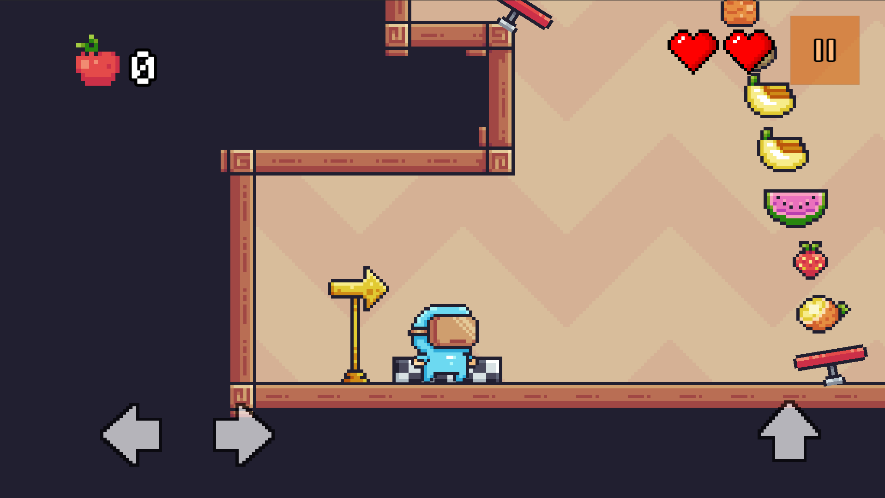
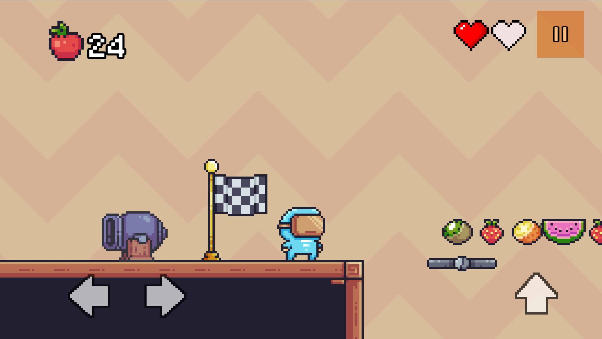
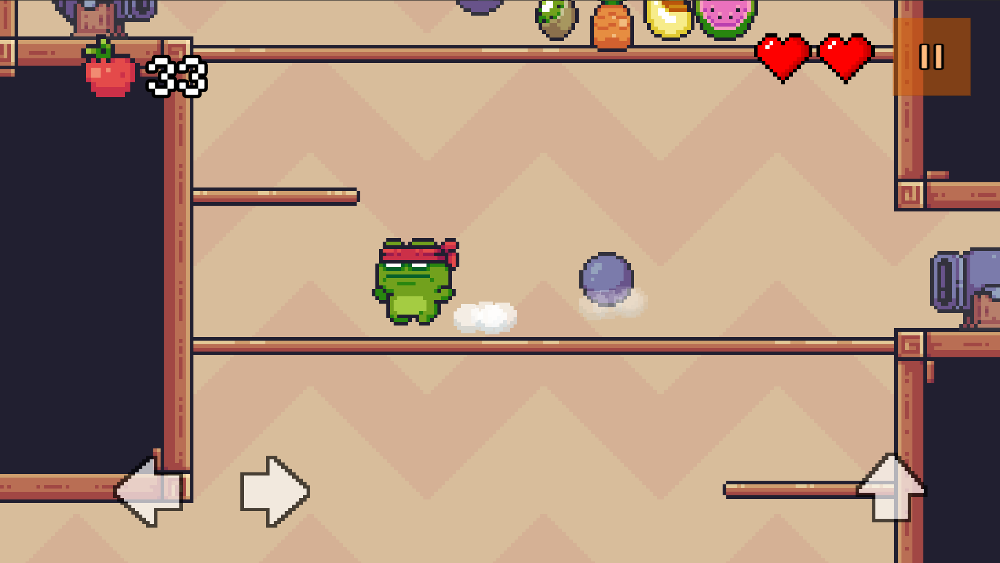
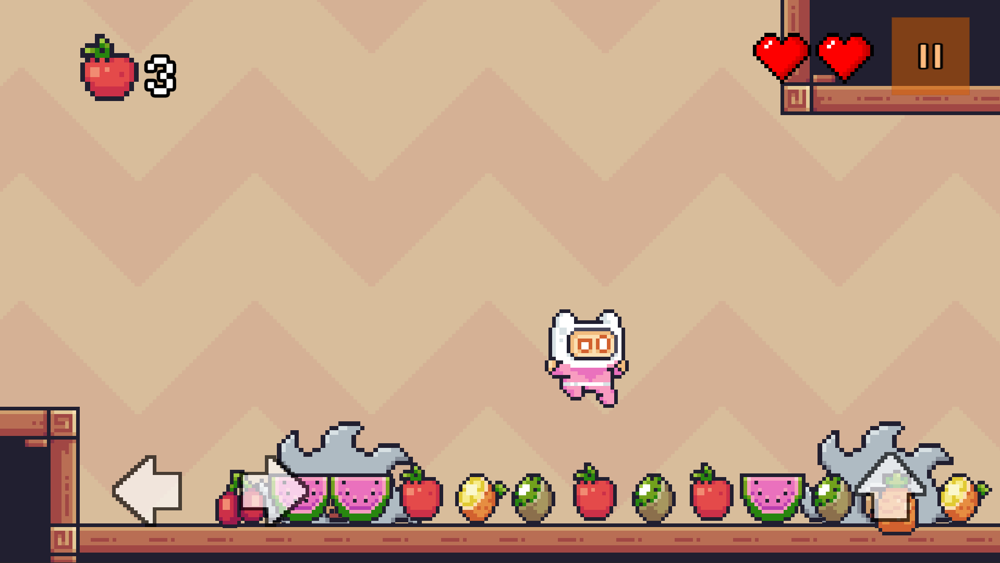

Edge Runners 🚀
🎮 Edge Runners, 2D pixel art tarzında aksiyon dolu bir platform oyunudur. Oyuncular, zorlu engelleri aşarak seviyeleri tamamlamaya çalışır.

🕹️ Oyun Özellikleri
✔ Pixel Art Grafikler – Retro tarzda 2D grafikler
✔ Akıcı Hareket Mekanikleri – Çift zıplama, duvardan sekme, duvardan kayma gibi gelişmiş parkur hareketleri
✔ Farklı Tuzak ve bölüm mekanikleri – Her biri kendine özgü mekaniklere sahip tuzaklar
✔ Seviye Tasarımı – Farklı zorluk seviyelerine sahip bölümler

📷 Ekran Görüntüleri

💻 Teknolojiler & Araçlar
Unity (Oyun motoru)
C# (Kodlama dili)

📦 Nasıl Çalıştırılır?
Unity 202x.x.x sürümünü yükleyin (bu kısmı kullandığın Unity sürümüne göre güncelle).

Bu repo’yu klonlayın:

sh
Kopyala
Düzenle
git clone https://github.com/KullaniciAdin/EdgeRunners.git
Unity ile açın ve çalıştırın.

📌 Durum & Planlar
✅ Oynanabilir temel mekanikler tamamlandı.
🔜 Yeni bölümler ve düşmanlar eklenecek.

📩 İletişim & Katkıda Bulunma
Geliştirme süreciyle ilgili geri bildirim vermek veya katkıda bulunmak için bana GitHub üzerinden ulaşabilirsiniz.
